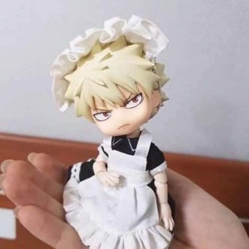

# DreamBooth или как персонализировать вашу диффузиоку
Наверняка, работая с text2img диффузионными моделями, вы сталкивались с проблемой неудачного синтеза. Даже прописав идеальное описание в prompt, вы получаете не совсем, то что хотели. Хоть это и замечательное отличительное свойство такого рода моделей - высокая способность к разнообразию, в неких моментах она не бывает так полезна. Например, хочется получить рекламный постер для новых духов, но, как не выкручивайся, только по текстовому описанию объекта и сцены не удастся заполучить желаемое. Зато мы обладаем небольшим набором фотографии флакона данного аромата. Дообучим? Наивный подход в виде finetuning не подойдет, ведь этому сопутствуют следующие проблемы:

    1. Дообучение всех параметров => большие вычислительные затраты 
    2. language drift => значения слов перезаписываются из-за кастомного набора изображении
    3. Перееобучение => на выходе имеем одни и те же изображения 

Однако, есть механизм персонализации диффузионных моделей под названием DreamBooth, где в процессе few-shots дообучения text2img модели (на ваш выбор), уменьшается ограниченность выразительности выходного домена. Имеем на входе сет изображении и предобученную text2img диффузионную модель, а на выходе получаем идентификатор объекта и ныне персонализированную модель. На основе своего кастомного датасета, можно синтезировать огромное множество различных сцен, сохраняя исходную семантику объекта.

Хороший результат получается за счет нескольких нововведении:

    1. Перезапись редких токенов
    Например, та самая собачка из статьи может быть записана под токеном pzq. Получается наш объект привязывается к определенному идентификатору. Для этого используется специальный prompt design “A picture of <RARE TOKEN> <CLASS>” . Токены можно брать отсюда (https://github.com/2kpr/dreambooth-tokens)
    2. Class-specific Prior Preservation Loss
    
    Пусть все также синтезируем собаку. Второе слагаемое отвечает за то, чтобы диффузионная модель все еще могла реконструировать других собак в процессе denoising, то есть помнила как другие собаки выглядят. Получается, что мы используем сэмплы текущего класса из начальной модели в процессе дообучения на новом домене с целью сохранить то самое разнообразие.

# Новый домен

Для проверки я собрал небольшой датасет из 7 изображении кукол nendroid

# Результаты

# Вывод

Проведя данный эксперимент, можно убедиться в работоспособности данного механизма персонализации, тем более в его качестве и "дешевости". Я считаю, что полученные результаты сравнимы с опубликованными в интернете (ну по крайней мере с аналогичными, обученными в таких же условиях, точно не хуже). Нейросеть запоминает объект и способна синтезировать его в других сценах и ситуациях.

Единсвтенное, не получилось добиться невероятной фотореалистичности, нежели с синтезом людей или животных. Также сложно оказалось подбирать параметры инференса, они действительно сильно влияли на результат. Для каждого нового промпта приходилось сделать 5-7 итерации подбора параметров для удачного синтеза
